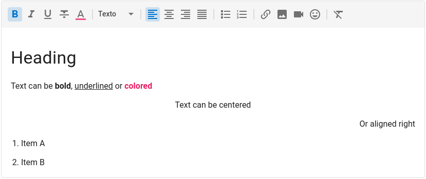

[![Stargazers][stars-shield]][stars-url]
[![Contributors][contributors-shield]][contributors-url]
[![Forks][forks-shield]][forks-url]
[![Issues][issues-shield]][issues-url]
[![MIT License][license-shield]][license-url]
[![LinkedIn][linkedin-shield]][linkedin-url]

## vuetify-tiptap

> 🚀 Awesome and extendable rich text editor component for Vuetify projects using tiptap



<p align="center">
    <a href="https://main--62508045836c88003a1f61fa.chromatic.com"><strong>View Demo</strong></a>
    ·
    <a href="#usage">Usage</a>
    ·
    <a href="#installation">Installation</a>
    ·
    <a href="#api">API</a>
    ·
    <a href="#license">License</a>
    ·
    <a href="#license">Maintainers</a>
</p>

## Usage

```vue
<v-tiptap v-model="value" />
```

To ensure full consistency between whats is seen in the editor and what you see when you render the HTML value, the component also has a view mode.

```vue
<v-tiptap v-model="value" view />
```

The toolbar is fully customizable and you can add, remove or reorder buttons. You can also use slots to add custom buttons with your own functionality.

```vue
<v-tiptap
  v-model="value"
  :toolbar="['bold', 'italic', '|', 'h1', 'p', '>', '#mybutton']"
>
    <template #mybutton="{ editor }">
        <v-btn icon small title="Clear Content" @click="editor.commands.clearContent()">
            <v-icon>mdi-delete-circle-outline</v-icon>
        </v-btn>
    </template>
</v-tiptap>
```

> ⚠️ This project uses Vue 2 and Vuetify 2. We plan to upgrade to Vue 3 as soon as Vuetify supports it.

## Instalation

First, install the package using npm or yarn.

```bash
npm i -S @peepi/vuetify-tiptap
```

Then add the package to the `transpileDependencies` config on `vue.config.js`

```js
module.exports = {
  transpileDependencies: ["vuetify", "@peepi/vuetify-tiptap"],
};
```

Finally, register the plugin on your main.ts.

```js
import VTiptap from "@peepi/vuetify-tiptap";

Vue.use(VTiptap);
```

### Uploading Images

In order to use the upload image feature, pass down a prop `uploadImage` to the component with a function that receives a File and returns a Promise to an URL.

```vue
<template>
  <v-tiptap :uploadImage="uploadImage" />
</template>

<script>
async function uploadImage(file) {
  const url = await myApi.upload(file);
  return url;
}
</script>
```

You can also pass this function as a global option to the plugin.

```js
Vue.use(VTiptap, { uploadImage: myApi.upload });
```

## Documentation

Check the <a href="https://main--62508045836c88003a1f61fa.chromatic.com">live demo</a> for documentation.

## Changelog

Please see [CHANGELOG](CHANGELOG.md) for more information what has changed recently.

## Contributing

Please see [CONTRIBUTING](CONTRIBUTING.md) for details.

## Credits

This package was developed at [Peepi](https://www.peepi.com.br), a SaaS platform to engage customers and employees.

- [Atila Silva](https://github.com/a2insights)
- [Ricardo Faust](https://github.com/alkin)
- [All Contributors](../../contributors)

## License

The MIT License (MIT). Please see [License File](LICENSE.md) for more information.

<!-- MARKDOWN LINKS & IMAGES -->
<!-- https://www.markdownguide.org/basic-syntax/#reference-style-links -->

[contributors-shield]: https://img.shields.io/github/contributors/peepi-com-br/vuetify-tiptap.svg?style=for-the-badge
[contributors-url]: https://github.com/peepi-com-br/vuetify-tiptap/graphs/contributors
[forks-shield]: https://img.shields.io/github/forks/peepi-com-br/vuetify-tiptap.svg?style=for-the-badge
[forks-url]: https://github.com/peepi-com-br/vuetify-tiptap/network/members
[stars-shield]: https://img.shields.io/github/stars/peepi-com-br/vuetify-tiptap.svg?style=for-the-badge
[stars-url]: https://github.com/peepi-com-br/vuetify-tiptap/stargazers
[issues-shield]: https://img.shields.io/github/issues/peepi-com-br/vuetify-tiptap.svg?style=for-the-badge
[issues-url]: https://github.com/peepi-com-br/vuetify-tiptap/issues
[license-shield]: https://img.shields.io/github/license/peepi-com-br/vuetify-tiptap.svg?style=for-the-badge
[license-url]: https://github.com/peepi-com-br/vuetify-tiptap/blob/master/LICENSE.txt
[linkedin-shield]: https://img.shields.io/badge/-LinkedIn-black.svg?style=for-the-badge&logo=linkedin&colorB=555
[linkedin-url]: https://linkedin.com/company/peepi
[product-screenshot]: images/screenshot.png
